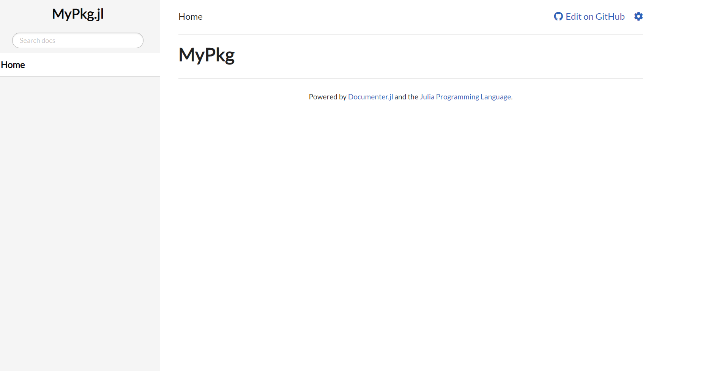

# Juliaパッケージを作成して、TravisCIと連携させる方法
OSはWindows10を仮定する。
簡単のため、git コマンドは GitHub Desktop で操作するものとする。
`> (文字列)` は、コマンドプロンプトに `(文字列)` を入力することを表す。

## パッケージの作成
1. Githubで新しくレポジトリを作成する。(e.g. LearnTravisCI)
1. ローカルのマシンにクローンする。`LearnTravisCI` という空ディレクトリができる。
1. `julia_package_template.jl` を `LearnTravisCI` へコピーする。
1. `julia_package_template.jl` を適切に編集する。詳しくはコード内のコメント参照。
1. `>julia julia_package_template.jl` を実行する。
1. `MyPkg` というパッケージを作ると仮定すると、現段階で以下のようなディレクトリ構造ができているはず。

```bash
(省略)/LearnTravisCI
│  julia_package_template.jl
│  README.md <- このファイル
│
└─MyPkg
    │  .gitignore
    │  .travis.yml
    │  LICENSE
    │  Manifest.toml
    │  Project.toml
    │  README.md
    │
    ├─.github
    │  └─workflows
    │          CompatHelper.yml
    │          TagBot.yml
    │
    ├─docs
    │  │  make.jl
    │  │  Manifest.toml
    │  │  Project.toml
    │  │
    │  └─src
    │         index.md
    │
    ├─src
    │       MyPkg.jl
    │
    └─test
            runtests.jl
```

## ドキュメントの生成
1. `startup.jl` に `push!(LOAD_PATH, "(省略)/LearnTravisCI/MyPkg/src")` と記入する。
1. `>julia MyPkg/docs/make.jl` によってドキュメントを生成する。警告は無視。
1. `MyPkg/docs` の中に `build` が生成されたはず。

```bash
(省略)/LearnTravisCI
│  julia_package_template.jl
│  README.md
│
└─MyPkg
    │  .gitignore
    │  .travis.yml
    │  LICENSE
    │  Manifest.toml
    │  Project.toml
    │  README.md
    │
    ├─.github
    │  └─workflows
    │          CompatHelper.yml
    │          TagBot.yml
    │
    ├─docs
    │  │  make.jl
    │  │  Manifest.toml
    │  │  Project.toml
    │  │
    │  ├─build
    │  │  │  index.html
    │  │  │  search.html
    │  │  │  search_index.js
    │  │  │
    │  │  └─assets
    │  │      │  documenter.js
    │  │      │  search.js
    │  │      │  themeswap.js
    │  │      │
    │  │      └─themes
    │  │              documenter-dark.css
    │  │              documenter-light.css
    │  │
    │  └─src
    │          index.md
    │
    ├─src
    │      MyPkg.jl
    │
    └─test
            runtests.jl
```

`julia -e "using LiveServer; serve(dir=\"MyPkg/docs/build\")"`
を実行し、ブラウザで `localhost:8000` を開くと、ドキュメントが閲覧できる。
ちなみに、Web で調べると
`julia -e 'using LiveServer; serve(dir="MyPkg/docs/build")'`
で行けると書いてあるが、少なくともWindowsでは動かなかった。
この辺はOSに依存しているかも。
いずれにせよ、以下のようなページが表示されていれば成功である。



最後に、ここまででできたものをGitHubへpushする。
GitHub からクローンしたときと、パッケージを作成したときにそれぞれ `.git` が作られてしまっていた場合は、どちらかを消去する。


## Deployキーの設定
1. `> julia create_deploy_key.jl` を実行する。
1. `ssh-rsa` から始まる文字列を GitHub に設定する。(Settings -> Deploy keys -> Add deploy key > Key の欄にコピー。Allow write access にチェックを入れる。)
1. TravisCI と GitHub を同期させ `LearnTravisCI` を active にする。
1. TravisCI側の `LearnTravisCI` レポジトリの設定から、環境変数を追加する。(Settings -> Environment Variables)
  - NAME欄に DOCUMENTER_KEY と入力
  - VALUE欄に `create_deploy_key.jl` で作った2つ目の文字列を入力

  
## ビルド
1. TravisCIのDashboardにレポジトリの一覧が見れる。Trigger a buildでビルドが実行される。
1. もしくは、GitHubにpushすると、それがトリガーとなってビルドが実行される。
1. 成功すれば、build passing状態となる。
1. GitHubのレポジトリのREADME.mdに、`docs dev`というボタン（バッジという）が追加されている。ここをクリックすると、ドキュメントが表示される。
    - この段階では、`docs stable`は404
1. GitHubから、レポジトリをリリースする。Tag version として、例えば `v0.1.0` などとする。
1. release すると、TravisCIでビルドされて、`docs stable` も見られるようになる。


## トラブルシューティング
- 上の設定でやると、レポジトリ名は `MyPkg.jl` である。
    - 対応するGitHubのアドレスは https://github.com/Shoichiro-Tsutsui/MyPkg.jl
    - https://github.com/Shoichiro-Tsutsui/MyPkg でないことに注意
- Settings -> GitHub Pages -> Source の設定を、 Branch: gh-pages, /docs にする。
    - ここが不正だと fatal: 'upstream/gh-pages' is not a commit and a branch 'gh-pages' cannot be created from it 
    
